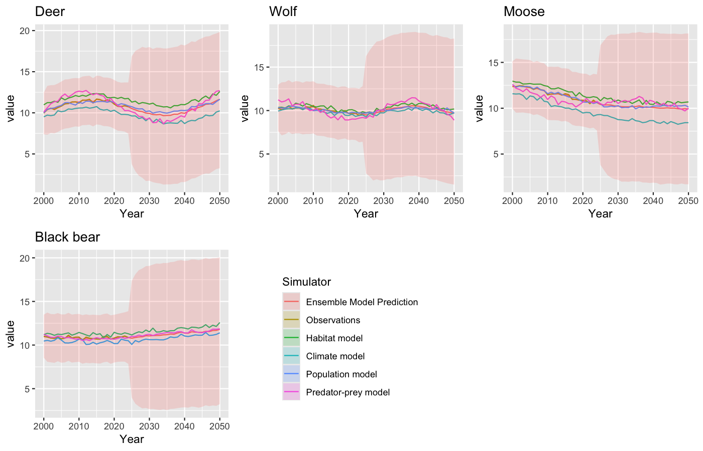
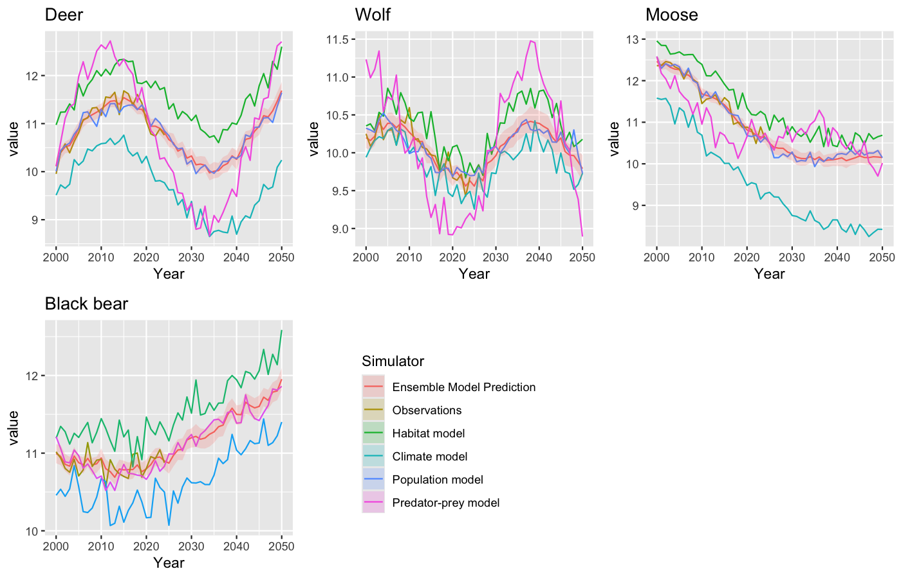
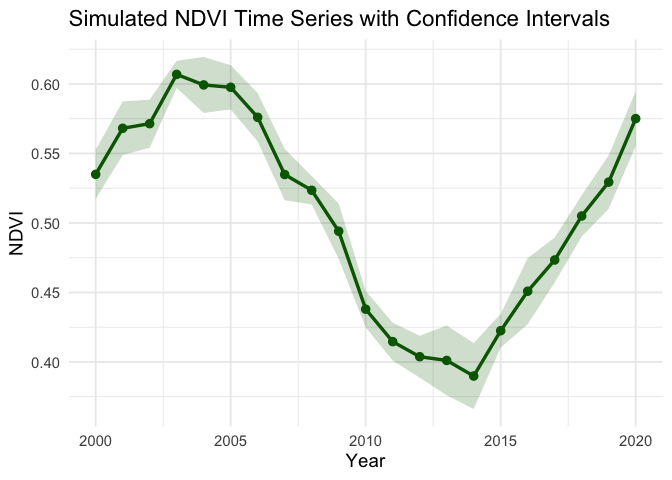

EcoEnsemble and Remote Sensing Time Series: A Synthetic Forest Mammal
and NDVI Example
================
Iris Nana Obeng
23-04-2026

## Introduction

EcoEnsemble is an R package that combines multiple ecosystem models into
a single ensemble prediction. Instead of relying on one model, it
integrates outputs from different simulators together with observed
data.

In this example, EcoEnsemble is applied to **synthetic forest mammal
populations** to demonstrate how the method works in a clear and
interpretable way.

The four species considered are:

- Deer
- Wolf
- Moose
- Black bear

The four simulators used are:

- Habitat model
- Climate model
- Population model
- Predator-prey model

Each simulator provides a different perspective on how populations
evolve over time. EcoEnsemble combines these into one final prediction
with uncertainty.

## Loading Packages

``` r
library(EcoEnsemble)
library(ggplot2)
library(dplyr)
```

## Defining Time and Species

This section defines the time period and the species included in the
synthetic example. These objects are later used to generate the virtual
population trends and label the outputs.

``` r
set.seed(456)

years <- 2000:2050
n_years <- length(years)
time <- 1:n_years

species_names <- c("Deer", "Wolf", "Moose", "Black bear")
predator_names <- c("Deer", "Wolf", "Moose")
```

- time is used to generate trends
- species_names defines the four populations
- predator_names is used for a simulator that only models three species

## Synthetic True Population Trends

This section creates the underlying synthetic population trends for the
four mammal species. These trends represent the “true” values from which
observations and simulator outputs are later generated.

``` r
deer_truth <- 10 + 0.03 * time + sin(time / 8)
wolf_truth <- 10 + 0.4 * sin(time / 5)
moose_truth <- 12 - 0.04 * time + 0.5 * cos(time / 10)
bear_truth <- 11 + 0.01 * time - 0.4 * sin(time / 12)

true_pop <- cbind(deer_truth, wolf_truth, moose_truth, bear_truth)
colnames(true_pop) <- species_names
```

Each species behaves differently:

- Deer slowly increases  
- Wolf fluctuates  
- Moose declines  
- Black bear remains relatively stable

## Observations (Partial Data)

This section creates synthetic observations by adding random noise to
the true population values for the early years only. This mimics a real
situation where historical observations are available, but future values
are unknown.

`Sigma_obs_mammals` defines the observation uncertainty matrix, which
assumes that each species has an independent observation error with a
standard deviation of 0.15. This means that the observed values will
deviate from the true population values by random amounts, reflecting
measurement error or natural variability in the data.

``` r
obs_years <- 1:25
obs_labels <- as.character(years[obs_years])

mammal_obs <- true_pop[obs_years, ] +
  matrix(rnorm(length(obs_years) * 4, sd = 0.15),
         nrow = length(obs_years))

mammal_obs <- as.data.frame(mammal_obs)
colnames(mammal_obs) <- species_names
rownames(mammal_obs) <- obs_labels

Sigma_obs_mammals <- diag(rep(0.15^2, 4))
colnames(Sigma_obs_mammals) <- species_names
rownames(Sigma_obs_mammals) <- species_names
```

## Distinct Simulator Outputs

This section creates different simulator outputs. Each simulator
represents a different ecological perspective, so the trends are
intentionally made different. The simulators are designed to behave
differently so that the ensemble has clearly distinct inputs to combine.
This allows EcoEnsemble to combine multiple competing model predictions.

``` r
sim_habitat <- cbind(
  deer_truth + 0.8,
  wolf_truth + 0.3,
  moose_truth + 0.5,
  bear_truth + 0.4
)

sim_climate <- cbind(
  deer_truth - 0.6 + seq(0, -1, length.out = n_years),
  wolf_truth - 0.2,
  moose_truth - 1.0 + seq(0, -0.8, length.out = n_years),
  bear_truth - 0.5
)

sim_population <- cbind(
  deer_truth + 0.1 * sin(time / 3),
  wolf_truth + 0.15 * cos(time / 4),
  moose_truth + 0.1 * sin(time / 6),
  bear_truth + 0.15 * cos(time / 5)
)

sim_predator <- cbind(
  deer_truth + 1.2 * sin(time / 7),
  wolf_truth + 0.8 * cos(time / 6),
  moose_truth - 0.7 * sin(time / 8)
)
```

## Add Noise and Format Data

This section adds random variation to the simulator outputs and formats
the data so that EcoEnsemble can read them correctly.

The covariance matrices (`Sigma_habitat`, `Sigma_climate`, etc.)
describe the uncertainty associated with each simulator. The diagonal
entries represent the variance of each species’ output, while the
off-diagonal entries are zero, indicating that the errors for different
species are assumed to be independent within each simulator. The
standard deviations (0.12, 0.15, etc.) reflect the level of uncertainty
we expect from each simulator’s predictions.

``` r
sim_habitat <- sim_habitat + matrix(rnorm(n_years * 4, 0, 0.15), n_years)
sim_climate <- sim_climate + matrix(rnorm(n_years * 4, 0, 0.15), n_years)
sim_population <- sim_population + matrix(rnorm(n_years * 4, 0, 0.10), n_years)
sim_predator <- sim_predator + matrix(rnorm(n_years * 3, 0, 0.20), n_years)

sim_habitat <- as.data.frame(sim_habitat)
sim_climate <- as.data.frame(sim_climate)
sim_population <- as.data.frame(sim_population)
sim_predator <- as.data.frame(sim_predator)

colnames(sim_habitat) <- species_names
colnames(sim_climate) <- species_names
colnames(sim_population) <- species_names
colnames(sim_predator) <- predator_names

rownames(sim_habitat) <- as.character(years)
rownames(sim_climate) <- as.character(years)
rownames(sim_population) <- as.character(years)
rownames(sim_predator) <- as.character(years)

Sigma_habitat <- diag(rep(0.12^2, 4))
Sigma_climate <- diag(rep(0.15^2, 4))
Sigma_population <- diag(rep(0.10^2, 4))
Sigma_predator <- diag(rep(0.13^2, 3))

colnames(Sigma_habitat) <- species_names
rownames(Sigma_habitat) <- species_names

colnames(Sigma_climate) <- species_names
rownames(Sigma_climate) <- species_names

colnames(Sigma_population) <- species_names
rownames(Sigma_population) <- species_names

colnames(Sigma_predator) <- predator_names
rownames(Sigma_predator) <- predator_names
```

## Define Priors

This section defines the prior assumptions used by the EcoEnsemble
model.

- EnsemblePrior() creates the full prior object for the ensemble model.
- IndSTPrior() defines the prior for the individual short-term
  discrepancies of the simulators.
- IndLTPrior() defines the prior for the individual long-term
  discrepancies.
- ShaSTPrior() defines the prior for the shared short-term discrepancy
  across simulators. Together, these priors describe the uncertainty
  structure of the model before fitting it to the observed data.

``` r
priors_mammals <- EnsemblePrior(
  4,
  ind_st_params = IndSTPrior(
    "hierarchical",
    list(-3, 1, 8, 4),
    list(0.1, 0.1, 0.1, 0.1),
    AR_params = c(2, 2)
  ),
  ind_lt_params = IndLTPrior("lkj", list(1, 1), 1),
  sha_st_params = ShaSTPrior("lkj", list(1, 10), 1, AR_params = c(2, 2)),
  sha_lt_params = 5
)
```

## Understanding the Figures

The figures are faceted time-series plots.

- Each panel represents one species.
- The x-axis shows the year.
- The y-axis shows the simulated population value.
- Colored lines show observations, simulator outputs, and the ensemble
  prediction.
- The shaded ribbon represents uncertainty.

## Figure 1: Prior Predictive Distribution

This section produces the prior predictive figure. \*
prior_ensemble_model() creates the prior version of the EcoEnsemble
model, using only the prior assumptions. \* sample_prior() generates a
sample from that prior model using the observations and simulator
structure. \* plot() visualizes the prior predictive distribution.

Figure 1 shows wide uncertainty because the model has not yet been
fitted to the observations.

``` r
prior_fit <- prior_ensemble_model(priors = priors_mammals, M = 4, full_sample = TRUE)

prior_samples <- sample_prior(
  observations = list(mammal_obs, Sigma_obs_mammals),
  simulators = list(
    list(sim_habitat, Sigma_habitat, "Habitat model"),
    list(sim_climate, Sigma_climate, "Climate model"),
    list(sim_population, Sigma_population, "Population model"),
    list(sim_predator, Sigma_predator, "Predator-prey model")
  ),
  priors = priors_mammals,
  sam_priors = prior_fit,
  num_samples = 1,
  full_sample = TRUE
)

png("Mammal_Figure1.png", width = 1400, height = 900, res = 150)
plot(prior_samples)
dev.off()
```



## Figure 2: Posterior Predictive Distribution

This section produces the posterior predictive figure.

- fit_ensemble_model() fits the EcoEnsemble model to the observed data
  and simulator outputs.
- generate_sample() generates predictions from the fitted model.
- plot() visualizes the posterior predictive distribution.

Figure 2 shows reduced uncertainty after the model has incorporated the
observed data.

``` r
fit <- fit_ensemble_model(
  observations = list(mammal_obs, Sigma_obs_mammals),
  simulators = list(
    list(sim_habitat, Sigma_habitat, "Habitat model"),
    list(sim_climate, Sigma_climate, "Climate model"),
    list(sim_population, Sigma_population, "Population model"),
    list(sim_predator, Sigma_predator, "Predator-prey model")
  ),
  priors = priors_mammals,
  full_sample = TRUE,
  chains = 1,
  iter = 300,
  warmup = 150,
  cores = 1
)

samples <- generate_sample(fit, num_samples = 1)

png("Mammal_Figure2.png", width = 1400, height = 900, res = 150)
plot(samples)
dev.off()
```



## Remote Sensing Time Series Representation

While EcoEnsemble provides a model-based approach that combines multiple
simulators, it is also useful to examine a simpler representation of
time-series data.

In this section, we simulate a remote sensing variable (NDVI) to
demonstrate how trends and uncertainty can be visualized directly
without using an ensemble model.

### Simulate Remote Sensing Data

``` r
set.seed(123)

years_ndvi <- 2000:2020
time_ndvi <- 1:length(years_ndvi)

ndvi_data <- data.frame(
  Year = rep(years_ndvi, each = 10),
  NDVI = 0.5 + 
         0.1 * sin(rep(time_ndvi, each = 10) / 3) +
         rnorm(length(years_ndvi) * 10, 0, 0.03)
)
```

This code simulates a remote sensing variable (NDVI), which represents
vegetation health over time.

- `set.seed(123)` ensures that the random values generated are
  reproducible.

- `years_ndvi` defines the time period.

- `time_ndvi` is a numeric index used to generate trends.

- `rep(years_ndvi, each = 10)` creates multiple observations per year,
  representing measurements from different satellite pixels.

- The NDVI values are generated using:

  - a baseline value (`0.5`)
  - a sinusoidal function (`sin(...)`) to create smooth temporal
    variation
  - random noise (`rnorm(...)`) to represent natural variability

This results in realistic-looking time-series data with variation across
years.

### Compute Summary Statistics

``` r
ndvi_summary <- ndvi_data %>%
  group_by(Year) %>%
  summarise(
    mean_ndvi = mean(NDVI),
    sd_ndvi = sd(NDVI),
    n = n(),
    se = sd_ndvi / sqrt(n),
    lower_ci = mean_ndvi - 1.96 * se,
    upper_ci = mean_ndvi + 1.96 * se
  )
```

This section summarizes the simulated NDVI data for each year.

- `group_by(Year)` groups the data by time.
- `mean(NDVI)` computes the average NDVI for each year.
- `sd(NDVI)` measures variability in the data.
- `n()` counts the number of observations per year.
- `se` (standard error) estimates the uncertainty in the mean.
- The confidence interval is calculated as:
  - lower bound: `mean - 1.96 × se`
  - upper bound: `mean + 1.96 × se`

These statistics are used to quantify uncertainty around the mean NDVI
values.

### Plot Time Series with Confidence Intervals

``` r
ndvi_plot <- ggplot(ndvi_summary, aes(x = Year, y = mean_ndvi)) +
  geom_ribbon(aes(ymin = lower_ci, ymax = upper_ci),
              fill = "darkgreen", alpha = 0.2) +
  geom_line(color = "darkgreen", linewidth = 1.2) +
  geom_point(color = "darkgreen", size = 2.5) +
  labs(
    title = "Simulated NDVI Time Series with Confidence Intervals",
    x = "Year",
    y = "NDVI"
  ) +
  theme_minimal(base_size = 14)

ndvi_plot
```

<!-- -->

This section visualizes the NDVI time series.

- `ggplot(...)` initializes the plot using Year on the x-axis and mean
  NDVI on the y-axis.
- `geom_ribbon(...)` creates the shaded band representing the confidence
  interval.
- `geom_line(...)` draws the main trend line of the mean NDVI over time.
- `geom_point(...)` adds points to show the mean value for each year.
- `labs(...)` adds the title and axis labels.
- `theme_minimal()` applies a clean visual style.

The final plot shows both the trend and the uncertainty in the NDVI
data.

### Interpretation

This figure shows the temporal evolution of a simulated vegetation index
(NDVI). The solid line represents the mean NDVI value for each year,
while The shaded region around the line represents the 95% confidence
interval, indicating uncertainty in the estimates.

The plot shows a smooth temporal pattern, with NDVI values increasing in
the early years, followed by a period of decline, and then a gradual
recovery. This reflects typical environmental variability that might be
observed in vegetation dynamics over time.

The relatively narrow confidence intervals indicate that the yearly
estimates are fairly consistent across observations, suggesting low
variability within each year.

Unlike the EcoEnsemble approach, this visualization does not combine
multiple models. Instead, it provides a direct and intuitive
representation of how a single environmental variable changes over time,
making it easier to interpret trends and variability without relying on
complex model assumptions.

## Conclusion

This example demonstrates how EcoEnsemble combines multiple simulator
outputs and observations into a single ensemble prediction with
uncertainty.

Figure 1 shows the model before it has learned from the data, while
Figure 2 shows the model after it has been fitted. Comparing the two
figures highlights how incorporating observations reduces uncertainty
and refines predictions.

The additional NDVI time-series example provides a simpler, data-driven
perspective. While EcoEnsemble offers a powerful modeling framework, the
NDVI plot shows that trends and uncertainty can also be communicated
clearly using basic statistical summaries.

Together, these approaches illustrate both complex and simple methods
for understanding ecological data.
